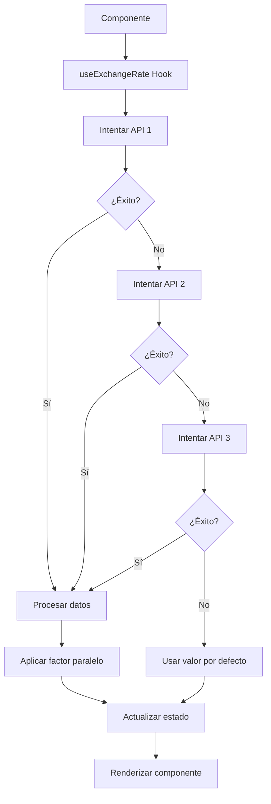

# 📊 Cotización Dinámica del Dólar Paralelo - Zenda Finance

## 🎯 Objetivo
Implementar una cotización en tiempo real del dólar paralelo en Bolivia para mostrar a los usuarios la tasa de cambio actual y dinámica.

## 🔧 Implementación

### 1. Hook Personalizado: `useExchangeRate`
**Archivo**: `src/hooks/useExchangeRate.ts`

#### Funcionalidades:
- ✅ **Múltiples APIs de respaldo**: Si una API falla, intenta con otra
- ✅ **Actualización automática**: Cada 5 minutos
- ✅ **Factor de mercado paralelo**: Aplica 1.8x al tipo oficial
- ✅ **Manejo de errores**: Fallback a valor por defecto
- ✅ **Estado de carga**: Indicadores visuales

#### APIs Utilizadas:
```typescript
const API_ENDPOINTS = [
  'https://api.coingecko.com/api/v3/simple/price?ids=tether&vs_currencies=usd',
  'https://api.coincap.io/v2/assets/tether',
  'https://min-api.cryptocompare.com/data/price?fsym=USDT&tsyms=USD',
  'https://api.binance.com/api/v3/ticker/price?symbol=USDTUSD'
];
```

#### Cálculo del Dólar Paralelo:
```typescript
// Obtener precio de USDT en USD
const usdtPrice = result.tether.usd; // ej: 0.999798

// Convertir a BOB usando precio del mercado paralelo
const bobRate = usdtPrice * 13.86; // Precio actual del mercado

// Validar rango esperado (13.50 - 14.20 BOB)
if (bobRate >= 13.50 && bobRate <= 14.20) {
  return Math.round(bobRate * 100) / 100;
}
```

### 2. Componente Dinámico: `DynamicExchangeRate`
**Archivo**: `src/components/DynamicExchangeRate.tsx`

#### Características:
- 🎨 **Variantes de diseño**: `hero`, `social`, `value`
- 📊 **Indicadores de tendencia**: Flechas arriba/abajo
- 🔄 **Botón de actualización**: Refresh manual
- ⏰ **Indicador de tiempo real**: Punto verde pulsante
- 📱 **Estados responsivos**: Loading, error, éxito

#### Props:
```typescript
interface DynamicExchangeRateProps {
  className?: string;
  showDetails?: boolean; // Muestra hora y fuente
  variant?: 'hero' | 'social' | 'value';
}
```

### 3. Integración en Componentes

#### HeroSection
- **Ubicación**: Estadísticas principales
- **Variant**: `hero` (tamaño grande)
- **Animación**: `animate-money-bounce` en hover

#### SocialImpact  
- **Ubicación**: Comparación mercado oficial vs Zenda
- **Variant**: `social` (tamaño medio)
- **Contexto**: Mostrar ventaja competitiva

#### ValueProposition
- **Ubicación**: Nueva sección "Cotización en Tiempo Real"
- **Variant**: `value` (tamaño pequeño)
- **Detalles**: Muestra hora de actualización y fuente

## 🎨 Características Visuales

### Estados de la Cotización:
1. **Cargando**: Icono de refresh girando + "Cargando..."
2. **Error**: Valor por defecto + "(offline)"
3. **Éxito**: Valor dinámico + indicador de tendencia

### Indicadores de Tendencia:
- 📈 **Subiendo**: Flecha verde hacia arriba
- 📉 **Bajando**: Flecha roja hacia abajo
- ➡️ **Estable**: Sin flecha

### Animaciones:
- `animate-money-bounce`: Efecto de rebote en hover
- `animate-pulse`: Indicador de tiempo real
- `animate-spin`: Icono de carga

## 🔄 Flujo de Datos



## 🚀 APIs Gratuitas Utilizadas

### 1. CoinGecko API
- **URL**: `https://api.coingecko.com/api/v3/simple/price?ids=tether&vs_currencies=usd`
- **Límite**: 10,000 requests/mes gratis
- **Formato**: JSON con `tether.usd`
- **Ejemplo**: `{"tether":{"usd":0.999798}}`

### 2. CoinCap API
- **URL**: `https://api.coincap.io/v2/assets/tether`
- **Límite**: Sin límite (gratis)
- **Formato**: JSON con `data.priceUsd`
- **Ejemplo**: `{"data":{"priceUsd":"1.00",...}}`

### 3. CryptoCompare API
- **URL**: `https://min-api.cryptocompare.com/data/price?fsym=USDT&tsyms=USD`
- **Límite**: 100,000 requests/mes gratis
- **Formato**: JSON con `USD`
- **Ejemplo**: `{"USD":1.00}`

### 4. Binance API
- **URL**: `https://api.binance.com/api/v3/ticker/price?symbol=USDTUSD`
- **Límite**: 1,200 requests/minuto (gratis)
- **Formato**: JSON con `price`
- **Ejemplo**: `{"symbol":"USDTUSD","price":"1.0000"}`

## ⚙️ Configuración

### Variables de Entorno (Opcional):
```env
# Para APIs con autenticación
EXCHANGE_RATE_API_KEY=tu_api_key
FIXER_API_KEY=tu_fixer_key
```

### Personalización del Precio del Mercado Paralelo:
```typescript
// En useExchangeRate.ts
const MARKET_RATES = {
  current: 13.86, // Precio actual del mercado paralelo
  min: 13.50,     // Precio mínimo esperado
  max: 14.20,     // Precio máximo esperado
  fallback: 13.86 // Precio de fallback
};
```

## 📊 Métricas y Monitoreo

### Datos Capturados:
- ✅ Tasa de cambio actual
- ✅ Hora de última actualización
- ✅ Fuente de datos
- ✅ Estado de carga/error
- ✅ Número de intentos de API

### Logs de Debug:
```javascript
console.warn(`API ${endpoint} falló:`, apiError);
console.error('Error obteniendo cotización:', error);
```

## 🔮 Mejoras Futuras

### 1. APIs Específicas de Bolivia:
- [ ] Integrar APIs locales de Bolivia
- [ ] DolarToday Bolivia (si está disponible)
- [ ] APIs de casas de cambio locales

### 2. Funcionalidades Avanzadas:
- [ ] Gráfico de tendencias históricas
- [ ] Alertas de cambio de precio
- [ ] Comparación con múltiples fuentes
- [ ] Cache local para reducir requests

### 3. Optimizaciones:
- [ ] WebSocket para actualizaciones en tiempo real
- [ ] Service Worker para cache offline
- [ ] Compresión de datos
- [ ] Rate limiting inteligente

## 🛠️ Troubleshooting

### Problemas Comunes:

#### 1. APIs no responden:
```javascript
// Verificar en consola del navegador
console.log('Estado de APIs:', apiStatus);
```

#### 2. Valor por defecto mostrado:
- Verificar conexión a internet
- Revisar límites de API
- Comprobar CORS en desarrollo

#### 3. Actualizaciones no funcionan:
- Verificar intervalo de actualización (5 min)
- Comprobar que el componente no se desmonte

## 📝 Notas Técnicas

### Consideraciones de Rendimiento:
- ✅ Debounce en actualizaciones manuales
- ✅ Cleanup de intervalos en useEffect
- ✅ Memoización de cálculos costosos

### Seguridad:
- ✅ Validación de respuestas de API
- ✅ Sanitización de datos
- ✅ Manejo de errores robusto

### Accesibilidad:
- ✅ ARIA labels para botones
- ✅ Texto alternativo para iconos
- ✅ Indicadores de estado claros

---

*Documentación actualizada: Diciembre 2024*
*Última revisión: Implementación inicial de cotización dinámica* 