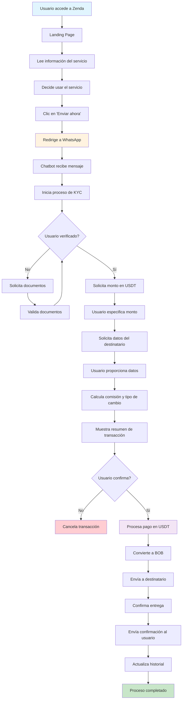

# 📱 Zenda Finance - Plataforma de Remesas con Blockchain

## 📋 Descripción del Proyecto

**Zenda Finance** es una plataforma web moderna diseñada para facilitar el envío de remesas desde Bolivia a cualquier parte del mundo utilizando tecnología blockchain y stablecoins. La plataforma se presenta como una solución innovadora que combina la simplicidad de WhatsApp con la potencia de las criptomonedas para ofrecer un servicio de remesas más económico y eficiente.

### 🎯 Objetivo Principal
Democratizar el acceso a las remesas internacionales para los bolivianos, ofreciendo:
- **Tasas competitivas**: ~13 BOB/USDT vs 6.96 BOB/USD oficial
- **Velocidad**: Transacciones en menos de 5 minutos
- **Accesibilidad**: Disponibilidad 24/7
- **Simplicidad**: Interfaz intuitiva y proceso guiado

### 🏗️ Arquitectura Técnica

#### Stack Tecnológico
- **Frontend**: React 18 + TypeScript
- **Styling**: Tailwind CSS + shadcn/ui
- **Bundler**: Vite
- **Routing**: React Router DOM
- **State Management**: React Query (TanStack Query)
- **Animations**: CSS Custom Animations + Framer Motion concepts

#### Estructura del Proyecto
```
zenda-finance-main/
├── src/
│   ├── components/
│   │   ├── HeroSection.tsx      # Sección principal con CTA
│   │   ├── HowItWorks.tsx       # Proceso de 3 pasos
│   │   ├── ValueProposition.tsx # Propuesta de valor
│   │   ├── SocialImpact.tsx     # Impacto social y comparativas
│   │   ├── Footer.tsx           # Pie de página
│   │   └── ui/                  # Componentes reutilizables
│   ├── pages/
│   │   ├── Index.tsx            # Página principal
│   │   └── ZendaLanding.tsx     # Layout principal
│   ├── assets/
│   │   └── zenda-hero.jpg       # Imagen de fondo
│   └── index.css                # Estilos globales y animaciones
├── public/                      # Archivos estáticos
└── package.json                 # Dependencias y scripts
```

## 🔍 Análisis de Fallas y Mejoras Pendientes

### 🚨 Fallas Críticas Identificadas

#### 1. **Funcionalidad Backend Ausente**
- **Problema**: La aplicación es solo un landing page sin funcionalidad real
- **Impacto**: No se pueden procesar transacciones reales
- **Solución**: Implementar API backend con:
  - Autenticación de usuarios
  - Integración con blockchain (Ethereum/Tron)
  - Sistema de KYC/AML
  - Gestión de transacciones

#### 2. **Integración WhatsApp Incompleta**
- **Problema**: Los enlaces de WhatsApp son estáticos (+59171234567)
- **Impacto**: No hay chatbot real funcionando
- **Solución**: 
  - Integrar WhatsApp Business API
  - Desarrollar chatbot inteligente
  - Implementar flujo de conversación real

#### 3. **Seguridad y Cumplimiento**
- **Problema**: No hay validaciones de seguridad
- **Impacto**: Vulnerable a ataques y no cumple regulaciones
- **Solución**:
  - Implementar KYC/AML
  - Validaciones de entrada
  - Encriptación de datos sensibles
  - Auditorías de seguridad

#### 4. **Gestión de Estados**
- **Problema**: No hay manejo de estados de transacciones
- **Impacto**: Usuario no puede rastrear sus envíos
- **Solución**:
  - Dashboard de usuario
  - Historial de transacciones
  - Notificaciones en tiempo real

### ⚠️ Fallas de UX/UI

#### 1. **Responsive Design**
- **Problema**: Algunos elementos no se adaptan bien en móviles
- **Solución**: Mejorar breakpoints y layout móvil

#### 2. **Accesibilidad**
- **Problema**: Falta de atributos ARIA y navegación por teclado
- **Solución**: Implementar estándares WCAG 2.1

#### 3. **Performance**
- **Problema**: Imágenes no optimizadas
- **Solución**: Implementar lazy loading y optimización de imágenes

### 🔧 Mejoras Técnicas Pendientes

#### 1. **Testing**
- **Falta**: Tests unitarios, de integración y E2E
- **Solución**: Implementar Jest, React Testing Library, Cypress

#### 2. **CI/CD**
- **Falta**: Pipeline de deployment automatizado
- **Solución**: GitHub Actions + Vercel/Netlify

#### 3. **Monitoring**
- **Falta**: Analytics y error tracking
- **Solución**: Google Analytics, Sentry

## 🔄 Diagrama de Flujo del Sistema



### 🔄 Flujo de Usuario Detallado

#### **Fase 1: Descubrimiento**
1. Usuario encuentra Zenda a través de marketing
2. Explora la landing page
3. Lee sobre beneficios y proceso
4. Revisa comparativas de precios

#### **Fase 2: Inicio de Transacción**
1. Clic en "Enviar ahora"
2. Redirección a WhatsApp
3. Interacción con chatbot
4. Verificación de identidad

#### **Fase 3: Procesamiento**
1. Especificación de monto
2. Datos del destinatario
3. Confirmación de transacción
4. Procesamiento blockchain

#### **Fase 4: Entrega**
1. Conversión USDT → BOB
2. Envío al destinatario
3. Confirmación de entrega
4. Notificación al remitente

## 📖 Manual de Usuario

### 👋 Para Nuevos Usuarios

#### **¿Qué es Zenda?**
Zenda es una plataforma que te permite enviar dinero desde Bolivia a cualquier parte del mundo usando criptomonedas (stablecoins) a través de WhatsApp. Es más rápido, económico y accesible que los métodos tradicionales.

#### **¿Por qué usar Zenda?**
- **💰 Mejor tasa de cambio**: ~13 BOB por USDT vs 6.96 BOB por USD oficial
- **⚡ Más rápido**: Envíos en menos de 5 minutos
- **🌍 Disponible 24/7**: Sin horarios bancarios
- **📱 Fácil de usar**: Todo desde WhatsApp
- **🔒 Seguro**: Tecnología blockchain

### 🚀 Cómo Usar Zenda (Paso a Paso)

#### **Paso 1: Acceder al Servicio**
1. Abre tu navegador web
2. Ve a la página de Zenda
3. Lee la información sobre el servicio
4. Haz clic en el botón verde "Enviar ahora"

#### **Paso 2: Iniciar Conversación**
1. Se abrirá WhatsApp automáticamente
2. Verás un mensaje pre-escrito: "enviar"
3. Envía el mensaje al chatbot de Zenda
4. El bot te dará la bienvenida y te guiará

#### **Paso 3: Verificación (Primera vez)**
1. El bot te pedirá algunos datos personales
2. Proporciona tu nombre completo
3. Comparte tu número de documento de identidad
4. El bot verificará tu identidad (proceso KYC)

#### **Paso 4: Especificar Transacción**
1. Escribe el monto que quieres enviar en USDT
2. Proporciona los datos del destinatario:
   - Nombre completo
   - Número de teléfono
   - Banco de destino (opcional)
3. El bot te mostrará el resumen

#### **Paso 5: Confirmar y Pagar**
1. Revisa todos los datos
2. Confirma la transacción
3. Recibe las instrucciones de pago
4. Envía los USDT a la dirección proporcionada

#### **Paso 6: Entrega**
1. El bot confirmará la recepción
2. Se procesará la conversión USDT → BOB
3. El dinero llegará al destinatario en minutos
4. Recibirás confirmación de entrega

### 📱 Interfaz de Usuario

#### **Sección Hero (Principal)**
- **Logo de Zenda**: Identidad de la marca
- **Título principal**: "Zenda: Envía rápido, vive tranquilo"
- **Descripción**: Explicación del servicio
- **Botón CTA**: "Enviar ahora" (verde llamativo)
- **Estadísticas**: ~13 BOB/USDT, <5 min, 24/7

#### **Sección "Cómo Funciona"**
- **Paso 1**: Escribe 'enviar' en WhatsApp
- **Paso 2**: Indica monto y destino
- **Paso 3**: Confirma y listo
- **Mockup de WhatsApp**: Ejemplo visual del chat

#### **Sección "Por qué Zenda"**
- **Rápida**: Blockchain para velocidad
- **Económica**: Tasas competitivas
- **Simple**: Todo desde WhatsApp
- **Segura**: KYC/AML y blockchain

#### **Sección "Impacto Social"**
- **Comparativa**: Mercado oficial vs Zenda
- **Estadísticas**: +87% más bolivianos por remesa
- **CTA**: "Únete a la revolución financiera"

### ⚠️ Consideraciones Importantes

#### **Antes de Usar**
- ✅ Tener WhatsApp instalado
- ✅ Tener USDT disponibles
- ✅ Documento de identidad a mano
- ✅ Datos del destinatario completos

#### **Durante el Proceso**
- ⏱️ El proceso toma 5-10 minutos
- 💬 Responde rápido al chatbot
- 📱 Mantén WhatsApp abierto
- 🔍 Revisa bien los datos antes de confirmar

#### **Después de la Transacción**
- ✅ Guarda el número de transacción
- 📞 Contacta soporte si hay problemas
- 📊 Revisa el historial en futuras transacciones

### 🆘 Soporte y Ayuda

#### **Problemas Comunes**
1. **Chatbot no responde**: Verifica tu conexión a internet
2. **Error en verificación**: Asegúrate de que los datos sean correctos
3. **Transacción fallida**: Contacta soporte con el número de transacción

#### **Contacto de Soporte**
- **WhatsApp**: +591 71234567
- **Horario**: 24/7
- **Respuesta**: En menos de 5 minutos

### 🔒 Seguridad y Privacidad

#### **Protección de Datos**
- ✅ Encriptación de datos sensibles
- ✅ Cumplimiento KYC/AML
- ✅ No compartimos datos con terceros
- ✅ Transacciones auditables en blockchain

#### **Recomendaciones de Seguridad**
- 🔐 Nunca compartas claves privadas
- 📱 Usa solo dispositivos seguros
- ✅ Verifica siempre las direcciones de pago
- 📞 Contacta soporte ante cualquier duda

---

## 📊 Métricas de Éxito

### **Objetivos del Proyecto**
- **Usuarios activos**: 10,000+ en el primer año
- **Volumen de transacciones**: $1M+ mensual
- **Satisfacción del usuario**: 95%+
- **Tiempo de transacción**: <5 minutos promedio

### **KPIs Técnicos**
- **Uptime**: 99.9%
- **Tiempo de carga**: <3 segundos
- **Tasa de conversión**: 15%+
- **Retención de usuarios**: 80%+

---

*Este documento se actualiza regularmente. Última actualización: Diciembre 2024* 